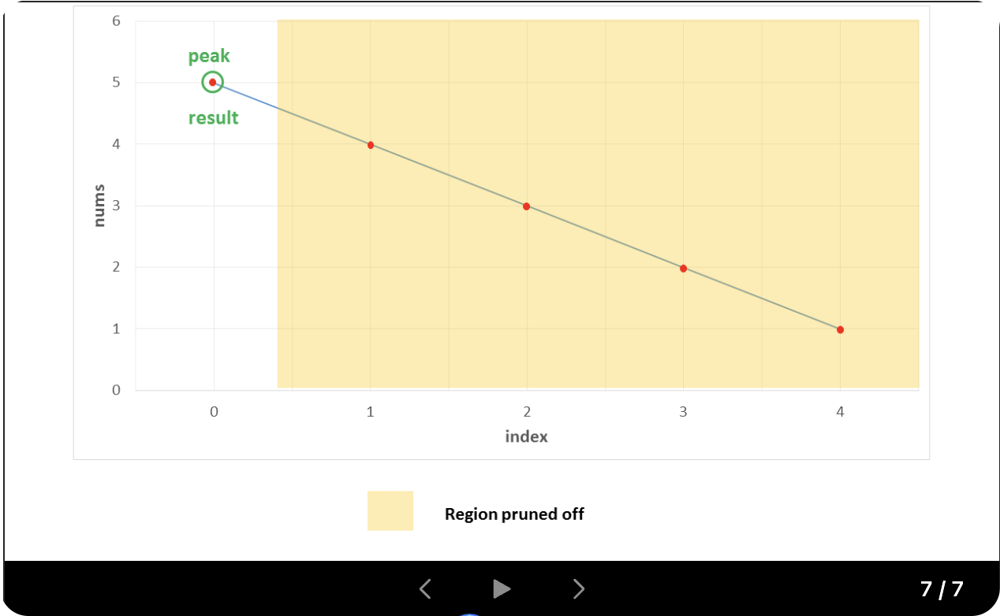
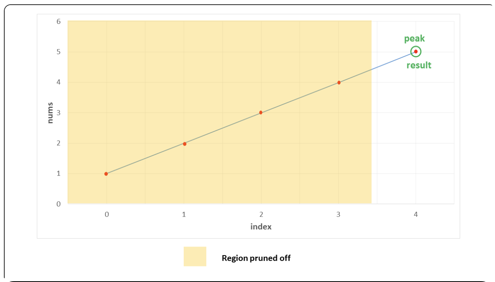
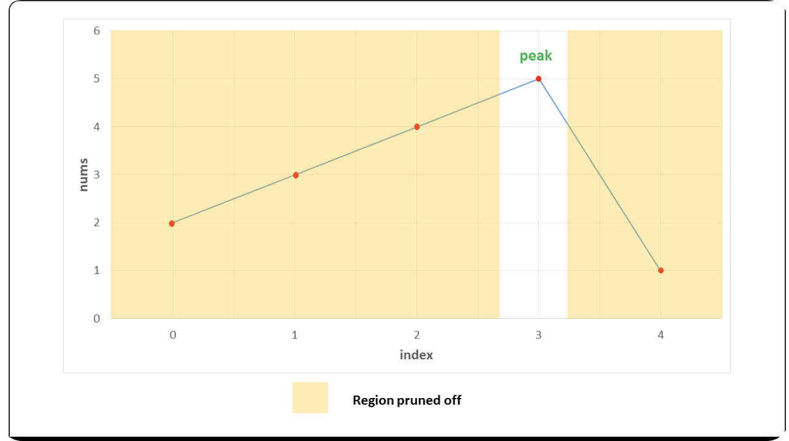

# 162 Find Peak Element

A peak element is an element that is strictly greater than its neighbors.

Given a 0-indexed integer array `nums`, find a peak element, and return its index. If the array contains multiple peaks, return the index to any of the peaks.

You may imagine that `nums[-1] = nums[n] = -∞`. In other words, an element is always considered to be strictly greater than a neighbor that is outside the array.

You must write an algorithm that runs in `O(log n)` time.

## Example 1:
```
Input: nums = [1,2,3,1]
Output: 2
Explanation: 3 is a peak element and your function should return the index number 2.
```

## Example 2:
```
Input: nums = [1,2,1,3,5,6,4]
Output: 5
Explanation: Your function can return either index 1 where the peak element is 2, or the index 5 where the peak element is 6.
```

## Constraints:
- `1 <= nums.length <= 1000`
- $-2^31 <= nums[i] <= 2^{31} - 1$
- `nums[i] != nums[i + 1]` for all valid `i`.


# Approach:

## Approach 1: Linear Search

In this approach, we make use of the fact that two consecutive numbers $nums[j]$ and $nums[j+1]$ are never equal. Thus, we can traverse over the $nums$ array starting from the beginning. Whenever, we find a number $nums[j]$, we only need to check if it is larger than the next number $nums[j+1]$ for determining if $nums[j]$ is the peak element. The reasoning behind this can be understood as the following three cases which cover every case into which any problem can be divided:

### Case 1: 
All the numbers appear in a descending order. In this case, the first element corresponds to the peak element. We start off by checking if the current element is larger than the next one. The first element satisfies this criteria, and is hence identified as the peak correctly. In this case, we did not reach a point where we needed to compare $nums[j]$ with $nums[j-1]$ also, to determine if it is the peak element or not.

### Case 2:
All the elements appear in ascending order. In this case, we keep on comparing $nums[j]$  with $nums[j+1]$  to determine if $nums[j]$ is the peak element or not. None of the elements satisfy this criteria, indicating that we are currently on a rising slope and not on a peak. Thus, at the end, we need to return the last element as the peak element, which returns out to be the correct. In this case, we need not compare $nums[j]$ with $nums[j-1]$, since being on the rising slope is a sufficient condition to ensure that $nums[j]$ is not the peak element.


### Case 3:
The peak appears somewhere in the middle. In this case, when we are traversing on the rising edge, as in Case 2, none of the elements will satisfy $nums[j] > nums[j+1]$. We need not compare $nums[j]$ with $nums[j-1]$ on the rising slope as dicussed above. When we finally reach the peak element, the condition $nums[j] > nums[j+1]$ will be satisfied. We again, need not compare $nums[j]$ with $nums[j-1]$. This is because, we could reach $nums[j]$ as the current element only when the check $nums[j]> nums[j+1]$ failed for the previous element $(i - 1)^th$ element, indicating that $nums[i-1] < nums[i]$. Thus, we able to identify the peak element correctly in this case as well.

### Implementation:

```python
class Solution:
    def findPeakElement(self, nums: List[int]) -> int:
        for i in range(len(nums) - 1):
            if nums[i] > nums[i + 1]:
                return i
        return len(nums) - 1
```

### Complexity Analysis:
- **Time Complexity**: $O(n)$, where $n$ is the length of the `nums` array. We traverse the array once to find the peak element.
- **Space Complexity**: $O(1)$, as we are using a constant amount of space for the variables.

## Approach 2: Binary Search

We can view any given sequence in $nums$ array as alternating ascending and descending sequences. By making use of this, and the fact that we can return any peak as the result, we can use make use of Binary Search to find the required peak element.

In case of simple Binary Search, we work on a sorted sequence of numbers and try to find out the required number by reducing the search space at every step. In this case, we use a modification of this simple Binary Search to our advantage. We start off by finding the middle element, $mid$ from the given $nums$ array. If this element happens to be lying in a descending sequence of numbers. or a local falling slope (found by comparing $nums[mid]$ with $nums[mid + 1]$), it means that the peak will always lie towards the left of this element. Thus, we reduce the search space to the left of $mid$(including itself) and perform the same process on left subarray.

If the middle element, $mid$ lies in an ascending sequence of numbers, or a rising slope(found by comparing $nums[mid]$ with $nums[mid + 1]$), it obviously implies that the peak lies towards the right of this element. Thus, we reduce the search scope to the right of this element. Thus, we reuce the search space to the right of $mid$ (excluding itself) and perform the same process on the right subarray.

In this way, we keep on reducing the search space till we eventually reach a state where only one element is remaining in the search space. This single element is the peak element.

To seee how it works, let's consider the three cases discussed above again.

### Case 1:
In this case, we firstly find 3 as the middle element. Since it lies on a falling slope, we reduce the search space to $[1, 2, 3]$. For this subarray, $2$ happens to be the middle element, which again lies on a faling slope, reducing the search space to $[1, 2]$. Now, $1$ acts as the middle element and it lies on a falling slope, reducing the search space to $[1]$. Thus, $1$  is returned as the peak correctly.


### Case 2:
In this case, we firstly find $3$ as the middle element. Since it lies on a rising slope, we reduce the search space to $[4, 5]$. Now, $4$ acts as the middle element for this subarray and it lies on a rising slope, reducing the search space to $[5]$. Thus, $5$ is returned as the peak correctly.


### Case 3:
In this case, the peak lies somewhere in the middle. The first middle element is $4$. It lies on a rising slope, indicating that the peak lies towards its right. Thus, the search space is reduced to $[5, 1]$. Now, $5$ happens to be the on a falling slope(relative to its right neighbor), reducing the search space to $[5]$ only. Thus, $5$ is returned as the peak correctly.



### Implementation:

```python
class Solution:
    def findPeakElement(self, nums: List[int]) -> int:
        def search(nums: List[int], start: int, end: int):
            if start == end:
                return end
            middle = (start + end) // 2
            if nums[middle] > nums[middle + 1]:
                return search(nums, start, middle)
            else:
                return search(nums, middle + 1, end)
        return search(nums, 0, len(nums) - 1)
```


### Complexity Analysis:
- **Time Complexity**: $O(\log n)$, where $n$ is the length of the `nums` array. We reduce the search space by half at every step.
- **Space Complexity**: $O(\log n)$, due to the recursive stack space used by the binary search function. If we use an iterative approach, the space complexity can be reduced to $O(1)$.


## Approach 3: Iterative Binary Search

The binary search discussed in the previous approach used a recursive method. We can do the same process in an iterative fashion also. This is done in the current approach.

```python
class Solution:
    def findPeakElement(self, nums: List[int]) -> int:
        start = 0
        end = len(nums) - 1
        while start < end:
            middle = (start + end) // 2
            if nums[middle] > nums[middle + 1]:
                end = middle
            else:
                start = middle + 1
        return start
```
### Complexity Analysis:

- **Time Complexity**: $O(\log n)$, where $n$ is the length of the `nums` array. We reduce the search space by half at every step.
- **Space Complexity**: $O(1)$, as we are using a constant amount of space for the variables.

**The C++ Version:**

```cpp
class Solution {
public:
    int findPeakElement(vector<int>& nums) {
        int n = nums.size();
        if (n == 1) return 0;
        int start = 0, end = n - 1;
        while (start <= end) {
            int middle = start + (end - start) / 2;
            if (middle > 0 && middle < n - 1 && nums[middle] > nums[middle - 1] && nums[middle] > nums[middle + 1]) {
                return middle;
            } else if (middle == 0 && nums[middle] > nums[middle + 1]) {
                return middle;
            } else if (middle == n - 1 && nums[middle] > nums[middle - 1]) {
                return middle;
            } else if (middle < n - 1 && nums[middle] < nums[middle + 1]) {
                start = middle + 1;
            } else {
                end = middle - 1;
            }
        }
        return -1; // This line should never be reached if input is valid
    }
};
```