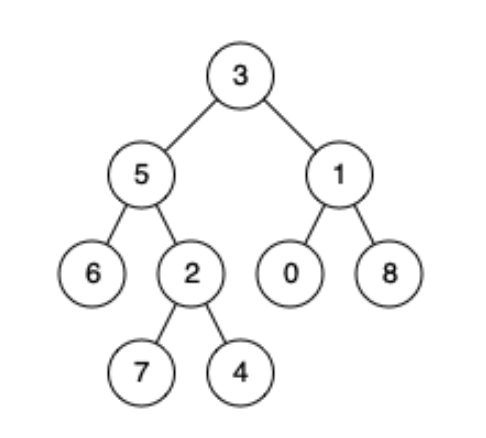
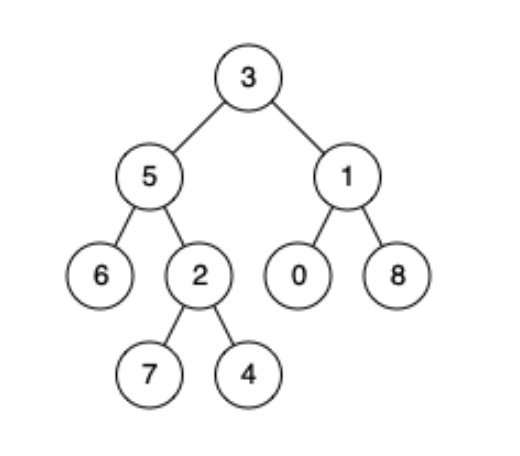

# 1650 Lowest Common Ancestor of a Binary Tree III

Given two nodes of a binary tree `p` and `q`, return their lowest common ancestor (LCA).

Each node will have a reference to its parent node. The definition for `Node` is:

```c++
class Node{
    public int val;
    public Node left;
    public Node right;
    public Node parent;
}
```
According to the definition of LCA on Wikipedia: "The lowest common ancestor of two nodes p and q in a tree T is the lowest node that has both p and q as descendants (where we allow a node to be a descendant of itself)."

## Example 1:


```
Input: root = [3,5,1,6,2,0,8,null,null,7,4], p = 5, q = 1

Output: 3
Explanation: The LCA of nodes 5 and 1 is 3.
```
## Example 2:


```
Input: root = [3,5,1,6,2,0,8,null,null,7,4], p = 5, q = 4
Output: 5
Explanation: The LCA of nodes 5 and 4 is 5 since a node can be a descendant of itself according to the LCA definition.
```

## Example 3:
```
Input: root = [1,2], p = 1, q = 2
Output: 1
```

## Constraints:
- The number of nodes in the tree is in the range `[2, 10^5]`.
- `-10^9 <= Node.val <= 10^9`
- All `Node.val` are unique.
- `p != q`
- `p` and `q` exist in the tree.


## Solution

**Problem Understanding**: We are given two nodes `p` and `q`, in a binary tree where each node has a reference to its parent. The task is to find their common ancestor (LCA). The LCA of two nodes `p` and `q` in a tree is defined as the deepest node that has both `p` and `q` as descendants, where we allow a node to be a descendant of itself.

### Approach 1

**Inutition**: To find the LCA of two nodes, we can leverage the fact that each node has a reference to its parent. By staring from one of the nodes (`p`), we can trace all the way up to the root and store the path in a list. Then, by traversing from the other node (`q`) towards the root, the first node that appears in the stored path must be the LCA.

**Approach**:
1. Trace Path for Node `p`:
   - Start from node `p`.
   - Traverse upwards using the parent pointers until you reach the root.
   - Store each visited node in a list called `path_p`.
2. Traverse from Node `q`:
    - Start from node `q`.
    - Traverse upwards using the parent pointers.
    - For each node encountered during this traversal, check if it exists in `path_p`.
    - The first node found in `path_p` is the LCA of `p` and `q`.

```python
"""
# Definition for a Node.
class Node:
    def __init__(self, val):
        self.val = val
        self.left = None
        self.right = None
        self.parent = None
"""

class Solution:
    def lowestCommonAncestor(self, p: 'Node', q: 'Node') -> 'Node':
        node_t = p
        path_p = []
        while node_t:
            path_p.append(node_t)
            node_t = node_t.parent
        
        node_t = q
        while node_t:
            if node_t in path_p:
                return node_t
            node_t = node_t.parent
```

### Complexity Analysis
- **Time Complexity**: O(h), where h is the height of the tree. In the worst case, we may need to traverse up to the root from both nodes.
- **Space Complexity**: O(h) for storing the path from node `p` to the root in `path_p`.