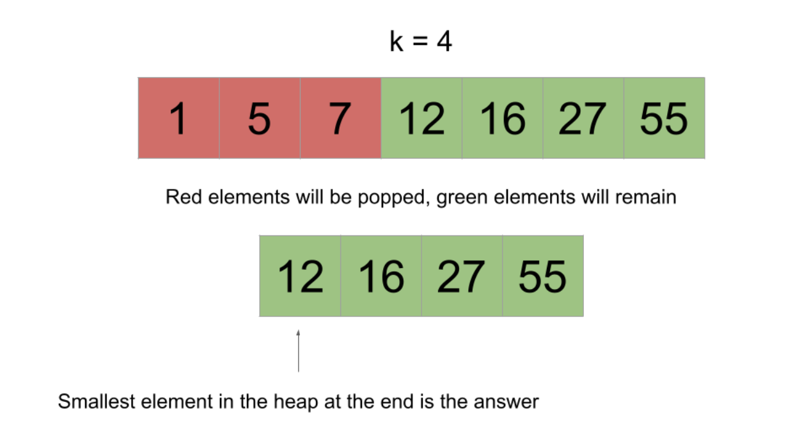

# 215. Kth Largest Element in an Array

Given an integer array `nums` and an integer `k`, return the `k`th largest element in the array.

Note that it is the `k`th largest element in the sorted order, no the `k`th distinct element.

Can you solve it without sorting?

## Example 1

```python
Input:nums = [3, 2, 1, 5, 6, 4], k = 2
Output: 5
```

## Example 2

```
Input: nums = [3, 2, 3, 1, 2, 4, 5, 5], k = 4
Output: 4
```

## Constraints

* $1 \leq k \leq nums.length \leq 10^5$
* $-10^4 \leq nums[i] \leq 10^4$


# Solution

## Approach 1: Sort

### Intuition

Sort the array in descending order and then return the $k^th$ element. Note that this is the "trival" approach and if asked this question in an interview, you would be expected to come up with a better solution than this.

### Implementation

```
Note: k is 1-indexed not 0-indexed. As such, we need to return the element at index `k-1` after sorting, not index `k`.
```

```python
class Solution:
    def findKthLargest(self, nums: List[int], k: int) -> int:
        nums.sort(reverse=True)
        return nums[k-1]
```

### Complexity Analysis

Given $n$ as the length of `nums`,

* Time Complexity: $O(n \log n)$ and Sorting `nums` requires $O(n \log n)$ time.

* Space Complexity: $O(log n)$ or $O(n)$ : The space complexity of the sorting algorithm depends on the implementation of each programming language.

    * In Jave, Arrays.sort() for primitive is implemented using a variant of the Quick Sort Algorithm, which has a space complexity of $O(log n)$.
    * In C++, the sort() function provided by STL uses a hybrid of Quick Sort, Heap Sort, Heap Sort, and Insertion Sort, with a worst-case space complexity of $O(log n)$. 
    * In Python, the sort() function is implemented using the Timesort algorithm, which has a worst-case space complexity of $O(n)$.

## Approach 2: Min-Heap

### Intuition

A heap is a very powerful data structure that allows us to efficiently find the maximum or minimum element in a dynamic dataset.

What is the **Heap**?

In many computer science applications, we only need to access the largest or smallest element in the dataset. We do not care about the order of other data in the data set. How do we efficiently access the largest or smallest element in the current dataset? The answer would be **Heap**.


The problem is asking for the $k$th largest element in the array. Let's push all the elements onto a **min-heap**, but pop from the heap when the size exceeds $k$. When we pop, the smallest  element is removed from the heap. By limiting the heap's size to $k$, after handling all elements, the heap will contain exactly the $k$ largest elements from the array.



It is impossible for one of the green elements to be popped because that would imply that there are at least $k$ elements in the array greater than it. This is because we only pop when the heap's size exceeds $k$. and popping removes the smallest element.

After we handle all the elements, we can just check the top of the heap. Because the heap is holding the $k$ largest elements and the top of the heap is the smallest element, the top of the heap would be the $k$th largest element, which is what the problem is asking for.


### Algorithm

1. Initialize a min-heap.
2. Iterate over the input. For each `num`:
    1. Push `num` onto the heap.
    2. If the size of heap exceeds `k`, pop the smallest element from the heap.
3. Return the top of the heap.

### Implementation

```
Note: C++ std::priority_queue implements a max-heap. To achieve min-heap functionality, we will multiply the values by -1 before pushing them onto the heap.
```

```python
class Solution:
    def findKthLargest(self, nums: List[int], k: int) -> int:
        heap = []
        for num in nums:
            heapq.heappush(heap, num)
            if len(heap) > k:
                heapq.heappop(heap)
        return heap[0]
```

### Complexity Analysis

Given $n$ as the length of `nums`,

* Time Complexity: $O(n \log k)$: Operations on a heap cost logarithmic time relative to its size. Because our heap is limited to a size of $k$, operations cost at most $O(\log k)$. We iterate over $nums$, performing one or two heap operations at each iteration.

We iterate $n$ times, performing up to $\log k$ work at each iteration, giving us a time complexity of $O(n \log k)$.

Because $k \leq n$, this is an improvement on the previous approach.

* Space Complexity: $O(k)$: The heap will contain at most $k$ elements at any time.