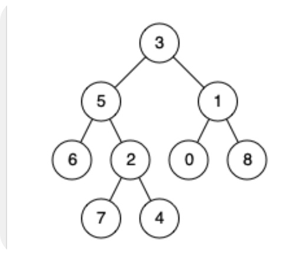
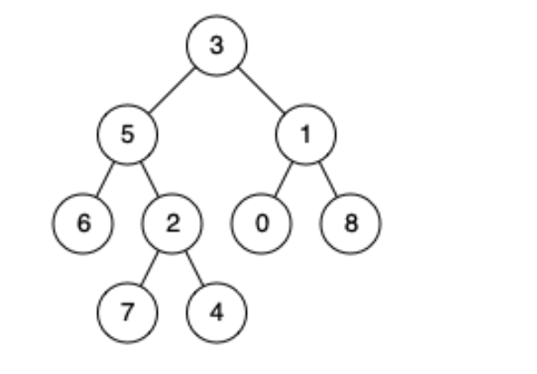
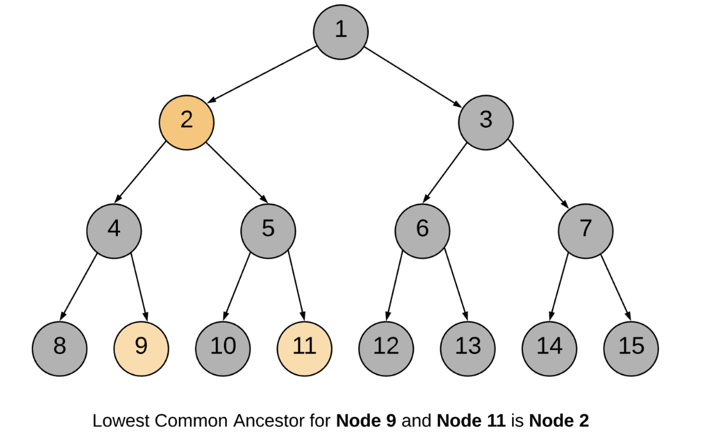
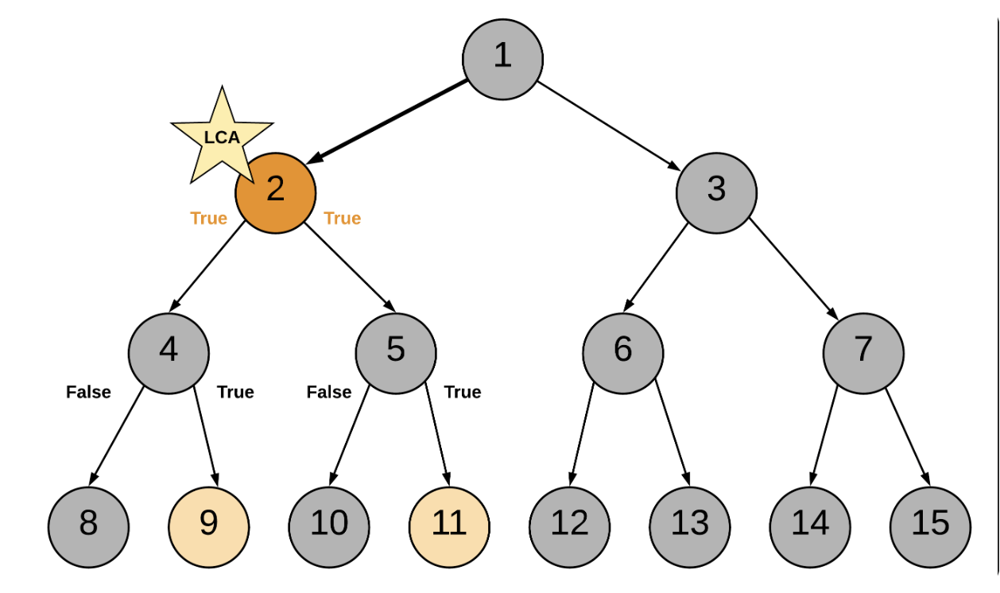

# 236 Lowest Common Ancestor of a Binary Tree

Given a binary tree, find the lowest common ancestor (LCA) of two given nodes in the tree.

According to the definition of LCA on Wikipedia: "The lowest common ancestor is defined between two nodes $p$ and $q$ as the lowest node in $T$ that has both $p$ and $q$ as descendants (where we allow a node to be a descendant of itself)."

## Example 1:



```
Input: root = [3,5,1,6,2,0,8,null,null,7,4], p = 5, q = 1
Output: 3
Explanation: The LCA of nodes 5 and 1 is 3.
```

## Example 2:


```
Input: root = [3,5,1,6,2,0,8,null,null,7,4], p = 5, q = 4
Output: 5
Explanation: The LCA of nodes 5 and 4 is 5, since a node can be a descendant of itself according to the LCA definition.
```

## Constraints:

- The number of nodes in the tree is in the range $[2, 10^5]$.
- $-10^9 \leq Node.val \leq 10^9$
- All $Node.val$ are unique.
- $p$ != $q$
- $p$ and $q$ will exist in the tree.


## Solution

First the given nodes $p$ and $q$ are to be searched in a binary tree and then their lowest common ancestor is to be found. We can resort to a normal tree traversal to search for the two nodes. Once we reach the desired nodes $p$ and $q$, we can backtrack and find the lowest common ancestor.



### Approach 1: Recursive Approach

#### Intuition

The approach is pretty intuitive. Traverse the tree in a depth first manner. The moment you encounter either of the nodes $p$ or $q$, return some boolean flag. The flag helps to determine if we found the required nodes in any of the paths. The least common ancestor would then be the node for which both the subtree recursion return a $True$ flag. It can also be the node which itself is one of $p$ or $q$ and for which one of the subtree recursions returns a $True$ flag.

Let us look at the formal algorithm based on this idea.

#### Algorithm

1. Start traversing the tree from the root node.

2. If the current node itself is one of $p$ or $q$, we would mark a variable $mid$ as $True$ and continue the search for the other node in the left and right branches.

3. If either of the left or the right branch return $True$, this means one of the two nodes was found below.

4. If at any point in the traversal, any two of the three flags $left$, $right$ or $mid$ become $True$, this means we have found the lowest common ancestor for the nodes $p$ and $q$. 

Let us look at a sample tree and we search for the lowest common ancestor of two nodes $9$ and $11$ in the tree.

Following is the sequence of nodes that are followed in the recursion:

```
1 --> 2 --> 4 --> 8
BACKTRACK 8 --> 4
4 --> 9 (ONE NODE FOUND, return True)
BACKTRACK 9 --> 4 --> 2
2 --> 5 --> 10
BACKTRACK 10 --> 5
5 --> 11 (ANOTHER NODE FOUND, return True)
BACKTRACK 11 --> 5 --> 2

2 is the node where we have left = True and right = True and hence it is the lowest common ancestor.
```

```python
# Definition for a binary tree node.
# class TreeNode:
#     def __init__(self, x):
#         self.val = x
#         self.left = None
#         self.right = None

class Solution:
    def __init__(self):
        # Variable to store LCA node.
        self.ans = None
    def lowestCommonAncestor(self, root: 'TreeNode', p: 'TreeNode', q: 'TreeNode') -> 'TreeNode':
        def recurse_tree(current_node: TreeNode) -> bool:
            # If reached the end of a branch, return False
            if not current_node:
                return False
            
            # Left Recursion
            left = recurse_tree(current_node.left)

            # Right Recursion
            right = recurse_tree(current_node.right)

            # If the current node is one of the p or q
            mid = current_node == p or current_node == q

            # If any two of the three flags left, right or mid become True.
            if mid + left + right >= 2:
                self.ans = current_node

            # Return True if either of the three bool values is True.
            return mid or left or right
        
        # Traverse the tree
        recurse_tree(root)
        return self.ans
```

## Complexity Analysis

* Time Complexity: $O(N)$, where $N$ is the number of nodes in the binary tree. In the worst case, we might be visiting all the nodes of the binary tree.

* Space Complexity: $O(N)$. This is because the maximum amount of space utilized by the recursion stack would be $N$ since the height of a skewed binary tree could be $N$.


## Approach 2: Iterative using parent pointers

#### Intuition

If we have parent pointers for each node we can traverse back from $p$ and $q$ to get their ancestors. The first common node we get during this traversal would be the LCA node. We can save the parent pointers in a dictionary as we traverse the tree.

#### Algorithm
1. Start from the root node and traverse the tree.

2. Until we find $p$ and $q$ both, keep storing the parent pointers in a dictionary.

3. Once we have found both $p$ and $q$, we get all the ancestors for $p$ using the parent dictionary and add to a set called `ancestors`.

4. Similarly, we traverse through ancestors for node $q$. If the ancestor is present in the ancestors set for $p$, this means this is the first ancestor common between $p$ and $q$ (while traversing upwards) and hence this is the LCA node.

```python
# Definition for a binary tree node.
# class TreeNode:
#     def __init__(self, x):
#         self.val = x
#         self.left = None
#         self.right = None

class Solution:
    def lowestCommonAncestor(self, root: 'TreeNode', p: 'TreeNode', q: 'TreeNode') -> 'TreeNode':
        stack = [root]

        parents = {root: None}

        while p not in parents or q not in parents:

            node = stack.pop()

            if node.left:
                parents[node.left] = node
                stack.append(node.left)
            if node.right:
                parents[node.right] = node
                stack.append(node.right)
            
        ancestors = set()

        while p:
            ancestors.add(p)
            p = parents[p]
        
        while q not in ancestors:
            q = parents[q]
        
        return q
``` 

#### Complexity Analysis

* Time Complexity: $O(N)$, where $N$ is the number of nodes in the binary tree. In the worst case we might be visting all the nodes of the binary tree.

* Space Complexity: $O(N)$. In the worst case space utilized by the stack, the parent pointer dictionary and the ancestor set, would be $N$ each, since the height of a skewed binary tree could be $N$.


