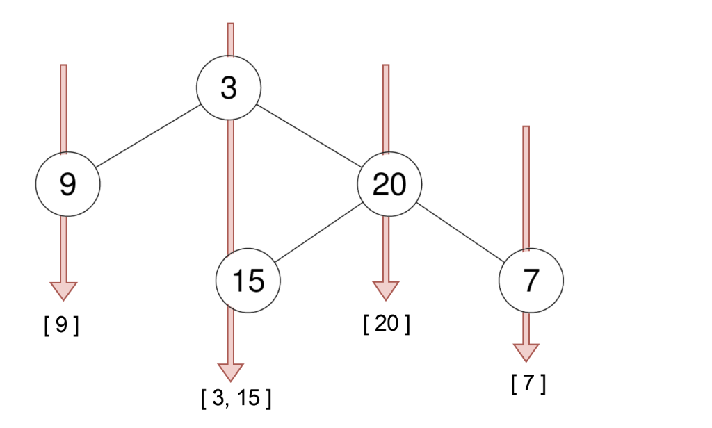
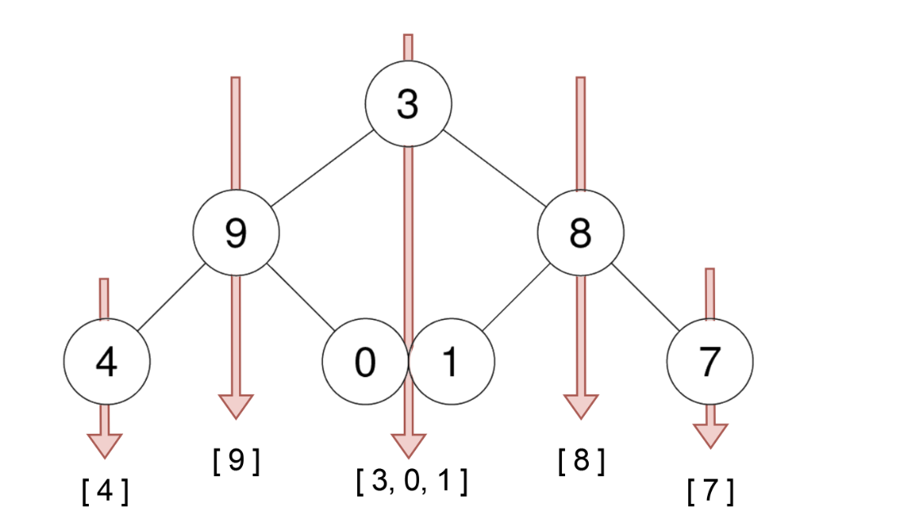
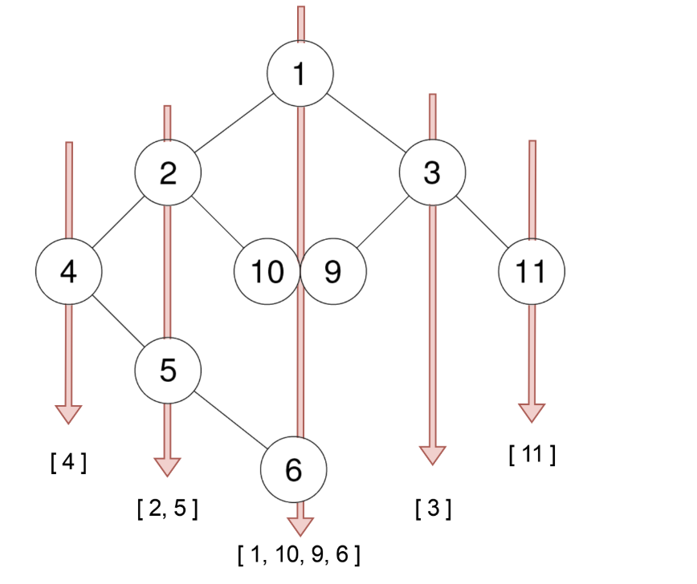
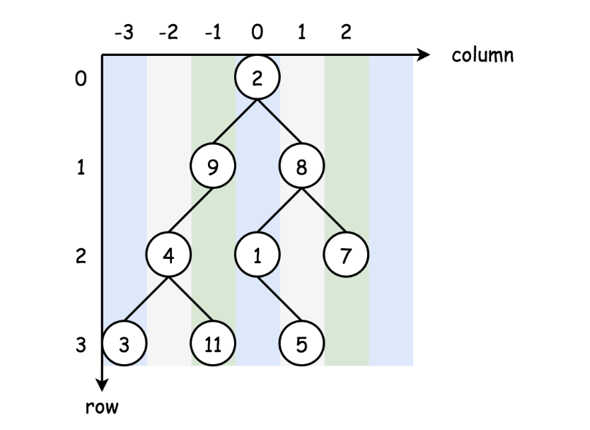

# 314 Binary Tree Vertical Order Traversal

Given the `root` of a binary tree, return the vertical order traversal of its nodes' values. (i.e., from top to bottom, column by column).

## Example 1


```
Input: root = [3, 9, 20, null, null, 15, 7]
Output: [[9], [3, 15], [20], [7]]
```

## Example 2


```
Input: root = [3,9,8,4,0,1,7]
Output: [[4],[9], [3, 0, 1], [8], [7]]
```

## Example 3


```
Input: root = [1,2,3,4,10,9,11,null,5,null,null,null,null,null,null,null,6]
Output: [[4],[2,5],[1,10,9,6],[3],[11]]
```
## Constraints
- The number of nodes in the tree is in the range `[1, 100]`.
- `-100 <= Node.val <= 100`


# Solution

This is yet another problem about Binary Tree Traversals. As one would probably know, the common strategies to traverse a Tree data structure are **Breadth First Search (BFS)** and **Depth First Search (DFS)**.

The DFS strategy can be further distinguished as pre-order DFS, inorder DFS, and postorder DFS, depending on the relative order of visit among the node itself and its child nodes.

If one is not familar with the concepts of BFS and DFS, one can find the corresponding problems on LeetCode to practice with. Also, we have an Explore card called Queue & Stack where we cover both the BFS traversal as well as the DFS traversal.
Hence, in this article, we will not repeat ourselves on these concepts.

In the problem description, we are asked to return the vertical order of a binary tree, which actually implies two sub-orders, where each node would have a 2-dimensional index (denoted as `<column, row>`).


- column-wise order: If we look at a binary tree horizontally, each node can be aligned to a specific `column`, based on its relative offset to the root node of the tree.

    - Let us assume that the root node has a column index of `0`, then its left child node would have a column index of `-1` and its right child node would have a column index of `+1`, and so on.

- row-wise order: Now, if we put the nodes into a vertical dimension, each node can be assigned to a specific `row`, based on its level (i.e., the vertical distance to the root node).

    - Let us assume that the root node has a row index of `0`, then both its child nodes would have the row index of `1`.
```
Given the above definition, we can now formulate the problem as a task to order the nodes based on the 2-dimensional coordinates that we defined above.
```

More specifically, the nodes should be ordered by `column` first, and further the nodes on the same column should be ordered **vertically** based on their `row` index.


## Approach 1: Breadth First Search (BFS)

### Intuition

With the formulation of the problem in the overview section, one of the most intuitive solutions to tackle the problem would be appplying the **BFS** traversal, where the nodes would be visited level by level.

With the BFS traversal, we naturally can guarantee that the vertical order of the visits i.e., the nodes at higher levels (large `row` values) would get visited later than the ones at lower levels.

However, we are still missing the horizontal order (the `column` order). To ensure this order, we need to do some additional processing during the BFS traversal.

```
The idea is that we keep a hash table (let us denote it as `columnTable<key, value>`), where we keep the node values grouped by their `column` index.
```

The `key` in the hash table would be the `column` index, and the corresponding `value` would be a list which contains the vlaues of all the nodes that share the same column index.

In addition, the values in the corresponding list should be ordered by their `row` indices, which would be guaranteed by the BFS traversal as we mentioned before.

### Algorithm

We elaborate on the steps to implement the above idea.
- First, we create a hash table named `columnTable` to keep track of the results.

- As to the BFS traversal, a common code pattern would be to usee a `queue` data structure to keep track of the order we need to visit nodes. We initialize the `queue` by putting the root node along with its column index value of `0`.

- We then run the BFS traversal with a loop consuming the elements form the `queue`.

- At each iteration within the BFS, we pop out an element from the queue. The element consists of a `node` and its corresponding `column` index. If the node is not empty, we then populate the `columnTable` with the value of the node. Subsequently, we then put its child nodes along with their respective column indices (i.e., `column - 1` and `column + 1`) into the queue.

- At the end of the BFS traversal, we obtain a hash table that contains the desired node values grouped by their column indices. For each group of values, they are further ordered by their row indices.

- We then sort the hash table by its keys, i.e., `column` index in ascending order. And finally, we return the results column by column.


```python
# Definition for a binary tree node.
# class TreeNode:
#     def __init__(self, val=0, left=None, right=None):
#         self.val = val
#         self.left = left
#         self.right = right
from collections import defaultdict
class Solution:
    def verticalOrder(self, root: Optional[TreeNode]) -> List[List[int]]:
        columnTable = defaultdict(list)
        queue = deque([(root, 0)])

        while queue:
            node, column = queue.popleft()

            if node is not None:
                columnTable[column].append(node.val)

                queue.append((node.left, column - 1))
                queue.append((node.right, column + 1))
        return [columnTable[x] for x in sorted(columnTable.keys())]
```

```cpp
/**
 * Definition for a binary tree node.
 * struct TreeNode {
 *    int val;
 *     TreeNode *left;
 *     TreeNode *right;
 *     TreeNode() : val(0), left(nullptr), right(nullptr) {}
 *     TreeNode(int x) : val(x), left(nullptr), right(nullptr) {}
 *     TreeNode(int x, TreeNode *left, TreeNode *right) : val(x), left(left), right(right) {}
 * };
 */
class Solution {
public:
    vector<vector<int>> verticalOrder(TreeNode* root) {
        map<int, vector<int>> columnTable;
        bfs(root, columnTable);
        vector<vector<int>> result;
        for (auto& [_, columnValues] : columnTable) {
            result.emplace_back(columnValues);
        }
        return result;
    }
    void bfs(TreeNode* root, map<int, vector<int>>& columnTable) {
        queue<pair<TreeNode*, int>> que;
        que.push({root, 0});
        while (!que.empty()) {
            auto [node, column] = que.front();
            que.pop();
            if (node != nullptr) {
                columnTable[column].emplace_back(node->val);
                que.push({node->left, column - 1});
                que.push({node->right, column + 1});
            }
        }
    }
};
 ```

## Complexity Analysis

- Time Complexity: $O(N \log N)$, where $N$ is the number of nodes in the tree.
    - In the first part of the algorithm, we do the BFS traversal, whose time complexity is $O(N)$ since we traversed each node once and only once.
    - In the second part, in order to return the ordered results, we then sort the obtained has table by its keys, which could result in the time complexity of $O(N \log N)$ in the worst case where the binary tree is extremely imbalanced (for instance, each node has only left child node.)
- Space Complexity: $O(N)$, where $N$ is the number of nodes in the tree.
    - First of all, we use a hash table to group the nodes with the same column index. The has table consists of keys and values. In any case, the values would consume $O(N)$ memory. While the space for the keys could vary, in the worst case, each node hasa a unique column index, i.e., there would be as many keys as the values. Hence, the total space complexity for the hash table would still be $O(N)$.
    - During the BFS traversal, we use a `queue` to keep track of the next nodes to visit. At any given moment, the queue would hold no more than two levels of nodes. For a binary tree, the maximum number of nodes at a level would be $(N + 1)/2$, which is also the number of leafs in a full binary tree. As a result, in the worst case, our queue would consume $O((N+1)/2 * 2) = O(N)$ memory.

    - Lastly, we also need some space to hold the results, which is basically a reordered hash table of size of $O(N)$ as we discussed before.

To sum up, the overall space complexity is $O(N)$.