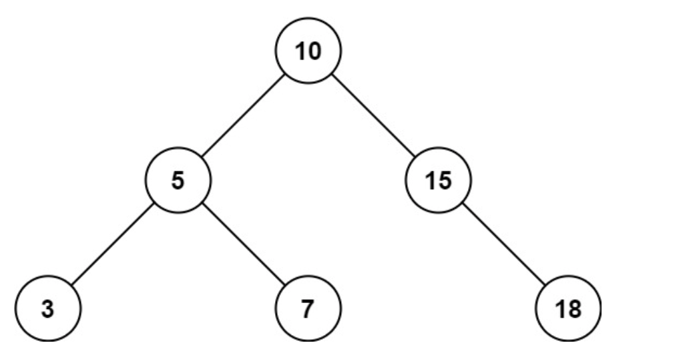

# 938 Range Sum of BST

Given the root node of a binary search tree and two integers `low` and `high`, return the sum of values of all nodes with a value in the inclusive range `[low, high]`.

## Example 1:

```
Input: root = [10,5,15,3,7,null,18], low = 7, high = 15
Output: 32
Explanation: Nodes 7, 10, and 15 are in the range [7, 15]. The sum is $7 + 10 + 15 = 32$.
```

## Constraints:
- The number of nodes in the tree is the range `[1, 2 * 10^4]`.
- `1 <= Node.val <= 10^5`
- `1 <= low <= high <= 10^5`
- All `Node.val` are unique.


## Solution:

### Approach 1: Depth-First-Search (DFS)

#### Intuition

We traverse the tree using a depth first search. If `node.val` fall outside the range `[low, high]`, (for example $node.val < low$ or $node.val > high$), then we know that only the right branch could have nodes with values inside the `[low, high]`.

We showcase two implementations - one using a recursive algorithm, and one using an iterative one.

### Recursive Implementation not considering binary search tree properties.
```python
# Definition for a binary tree node.
# class TreeNode:
#     def __init__(self, val=0, left=None, right=None):
#         self.val = val
#         self.left = left
#         self.right = right
class Solution:
    def __init__(self):
        self.res = 0
    def rangeSumBST(self, root: Optional[TreeNode], low: int, high: int) -> int:

        def traverse_tree(node: Optional[TreeNode]):
            if node == None:
                return
            if node.val >= low and node.val <= high:
                self.res += node.val
            traverse_tree(node.left)
            traverse_tree(node.right)

        traverse_tree(root)
        return self.res
```

The recursive implementation traverse consiering the binary search tree properties.

```python
# Definition for a binary tree node.
# class TreeNode:
#     def __init__(self, val=0, left=None, right=None):
#         self.val = val
#         self.left = left
#         self.right = right
class Solution:
    def __init__(self):
        self.res = 0
    def rangeSumBST(self, root: Optional[TreeNode], low: int, high: int) -> int:

        def traverse_tree(node: Optional[TreeNode]):
            if node == None:
                return
            if node.val >= low and node.val <= high:
                self.res += node.val
            if low < node.val:
                traverse_tree(node.left)
            if high > node.val:
                traverse_tree(node.right)

        traverse_tree(root)
        return self.res
```

The interative implementation version.

```python
# Definition for a binary tree node.
# class TreeNode:
#     def __init__(self, val=0, left=None, right=None):
#         self.val = val
#         self.left = left
#         self.right = right
class Solution:
    def rangeSumBST(self, root: Optional[TreeNode], low: int, high: int) -> int:
        stack = [root]
        ans = 0
        while stack:
            node = stack.pop()
            if low <= node.val <= high:
                ans += node.val
            if node.left and low < node.val:
                stack.append(node.left)
            if node.right and high > node.val:
                stack.append(node.right)
        return ans
```

### Complexity Analysis
- **Time Complexity**: $O(N)$, where $N$ is the number of nodes in the tree.

- **Space Complexity**: $O(N)$, 
    - Fort he recurisve and iterative implementations, we are performing a DSF (depth-First-Search) traversal. The recursive solution requires additional space to maintain the function call stack while the iterative solution requires additional space to maintain the stak. In both implementations, the worst case scenario occurs whent he tree is of chain shape, and we will reach all the way down to the leaf node. In this case, the space required for the stack is $O(N)$.