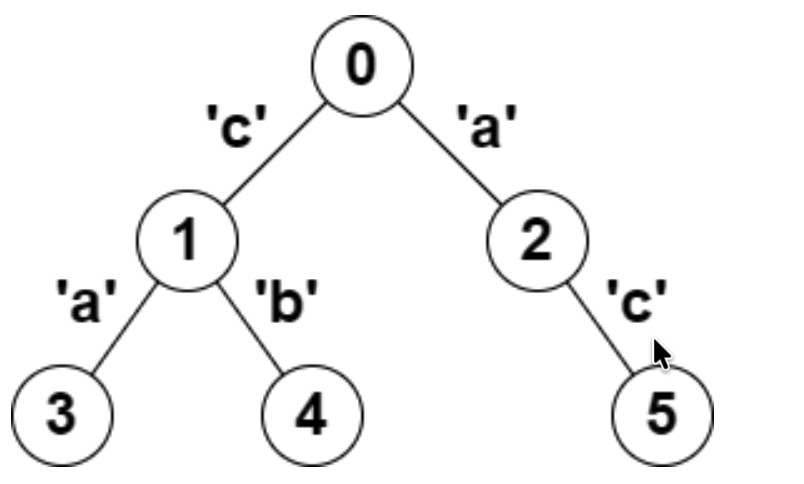

# 2791 Count Paths That Can Form a Palindrome in a Binary Tree

You are given a tree (i.e. a connected, undirected graph that has no cycles) rooted at node `0` consisting of `n` nodes numbered from `0` to `n - 1`. The tree is represented by a 0-indexed array `parent` of size `n`, where `parent[i]` is the parent of node `i`. Since node `0` is the root, `parent[0] == -1`. 

You are also given a string `s` of length `n`, where `s[i]` is the character assigned to the edge between  `i` and `parent[i]`. `s[0]` can be ignored.

Return the number of pairs of nodes `(u, v)` such that `u < v` and the characters assigned to the edges on the path from `u` to `v` can be rearranged to form a palindrome.

A string is a palindrom when it reads the same backwards as forwards.

## Example 

**Example 1:**



```
Input: parent = [-1,0,0,1,1,2], s = "acaabc"
Output: 8
Explanation: The valid pairs are:
- All the pairs (0,1), (0,2), (1,3), (1,4), (2,5) result in one character, which is a palindrome.

- The pair (2,3) result in the string "aca" which is a palindrome.

- The pair (1,5) result in the string "cac" which is a palindrome.

- The pair (3,5) result in the string "acac" which can be rearranged to "acca", which is a palindrome.
```

## Constraints:
* `n == parent.length == s.length`
* `1 <= n <= 10^5`
* `0 <= parent[i] <= n - 1` for `i >= 1`
* `parent[0] == -1`
* `parent` represents a valid tree.
* `s` consists of lowercase English letters.


## Solution

### Core Insight: Palindrome $\gets\to$ Bitmask

A string can be rearranged into a palindrome if and only if at most one character has an odd frequency. Since there are only 26 lowercase letters, you can represent the parity of each character's frequency as a 26-bit integer (bitmask) -- bit `i` is 1 if the character `i` appears an odd number of times on the path, `0` otherwise.

So a path `(u, v)` is valid if its bitmask  has at most 1 bit set.

### Root-to-Node XOR Encoding

The key observation is that the path from `u` to `v` passes through their lowest common ancestor (LCA). If you define `xor[u]` as the XOR of all edge bitmasks on the path from the root to `u`, then 
$$
\mathsf{xor}[u\to v] = \mathsf{xor}[u] \oplus \mathsf{xor}[v]
$$

This works because the root-to-LCA portion cancels out when XOR'd. So a pair `(u, v)` is valid if 'xor[u] XOR xor[v]' has at most one bit set.

### Algorithm: DFS + Frequency Map

Run a single DFS from the root, maintaining a frequency map `cnt` of all `xor[node]` values seen so far.

For each new node with path-XOR value `x`, count valid pairs:

1. All-even case (0 bits set): look up `cnt[x]` -- nodes whose XOR equals `x` exactly.

2. One-off case(1 bit set): for each of 26 possible bits `k`, look up `cnt[x ^ (1 << k)]` -- nodes whose XOR differs from `x` by exactly one bit.


### Algorithm

```c++
class Solution {
public:
    long long countPalindromePaths(vector<int>& parent, string s) {
        int n = parent.size();
        vector<vector<pair<int, int>>> tree(n);
        for (int i = 1; i < n; ++i) {
            int mask = 1 << (s[i] - 'a');
            tree[parent[i]].emplace_back(i, mask);
        }

        long long ans = 0;
        unordered_map<int, int> cnt; // frequency of xor values
        stack<pair<int, int>> stk; // (node, xor value)
        
        cnt[0] = 1; // base case: empty path has XOR 0
        stk.emplace(0, 0); // start DFS from root with XOR 0
        while (!stk.empty()) {
            auto [node, xorVal] = stk.top();
            stk.pop();
            for (auto& [child, mask] : tree[node]) {
                int x = xorVal ^ mask; // XOR for child node
                ans += cnt[x]; // pairs with same XOR (0 bits set)
                for (int k = 0; k < 26; ++k) {
                    ans += cnt[x ^ (1 << k)]; // pairs with one bit different
                }
                cnt[x]++; // add current XOR to frequency map
                stk.emplace(child, x); // continue DFS
            }
        }
        return ans;
    }
};
```