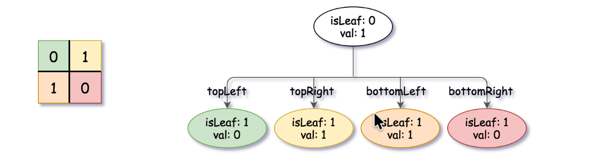
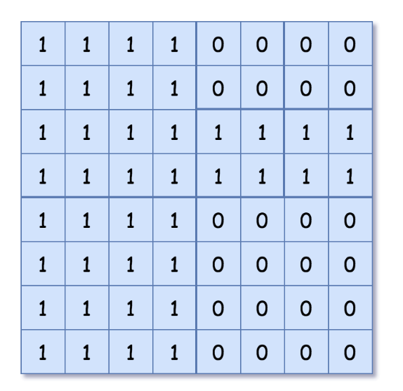

# 427 Construct Quad Tree

Given a $n \times n$ matrix `grid` of `0's` and `1's` only. We want to represent the `grid` with a Quad-Tree.

Return the root of the Quad-Tree representing `grid`.

A Quad-Tree is a tree data structure in which each internal node has exactly four children. Besides, each node has two attributes:
* `val`: True if the node represents a grid of 1's or False if the node represents a grid of 0's. Notice that you can assign the `val` to True or False when `isLeaf` is False, and both are accepted in the answer.

* `isLeaf`: True if the node is leaf node on the tree or False if the node has the four children. 

```c++
class Node {
    public boolean val;
    public boolean isLeaf;
    public Node topLeft;
    public Node toRight;
    public Node bottomLeft;
    public Node bottomRight;
};
```
We can construct a Quad-Tree from a two-dimensional area using the following steps:

1. If the current grid has the same value (i.e., all `1's` or all `0's`) set `isLeaf` to True and `val` to the value of the grid and set the four children to Null and stop.

2. If the current grid has different values, set `isLeaf` to False and set `val` to any value and divide the current grid into four sub-grids as shown in the photo.

3. Recurse for each of the children with the proper sub-grid.

**Quad-Tree format:** 

You don't need to read this section for solving the problem. This is only if you want to understand the output format here. The output represents the serialized format of a Quad-Tree using level order traversal, where `null` signifies a path terminator where no node exists below.

It is very similar to the serialization of the binary tree. The only difference is that the node is represented as a list `[isLeaf, val]`. 

If the value of `isLeaf` or `val` is True we represent it as 1 in the list `[isLeaf, val]` and if the value of `isLeaf` or `val` is False we represent it as 0.

## Examples

**Example 1:**
```
Input: grid = [[0,1],[1,0]]
Output: [[0,1],[1,0],[1,1],[1,1],[1,0]]

Explanation: The explanation of this example is shown below:

Notice that 0 represents False and 1 represents True in the photo representing the Quad-Tree.
```


Note that for the non-leaf node in Quad-Tree, `val` can be either True or False, so the output `[0,1]` and `[0,0]` are both accepted.


**Example 2:**


```
Input: grid = [[1,1,1,1,0,0,0,0],[1,1,1,1,0,0,0,0],[1,1,1,1,1,1,1,1],[1,1,1,1,1,1,1,1],[1,1,1,1,0,0,0,0],[1,1,1,1,0,0,0,0],[1,1,1,1,0,0,0,0],[1,1,1,1,0,0,0,0]]
Output: [[0,1],[1,1],[0,1],[1,1],[1,0],null,null,null,null,[1,0],[1,0],[1,1],[1,1]]

Explanation: All values in the grid are not the same. We divide the grid into four sub-grids.
The topLeft, bottomLeft and bottomRight each has the same value. The topRight have different values so we divide it into 4 sub-grids where each has the same value.
Explanation is shown in the photo below:
```


## Constraints
* `n == grid.length == grid[i].length`
* `n == 2^x` where `0 <= x <= 6`


## Solution

### Core Idea
The key insight is divide and conquer: recursively split the grid into four quadrants. A region becomes a leaf node when all its values are identical; otherwise, it becomes an internal node with four children representing the quadrants.

An optional optimization uses a 2D prefix sum to check region uniformity in O(1) instead of $O(n^2)$ per region, improving efficiency for larger grids.

### Prompt for Sonnet from Complexity
```text
Teach me how to solve the leaf page problem in C++ with modularization.
```
### C++
```c++
/*
// Definition for a QuadTree node.
class Node {
public:
    bool val;
    bool isLeaf;
    Node* topLeft;
    Node* topRight;
    Node* bottomLeft;
    Node* bottomRight;

    Node() {
        val = false;
        isLeaf = false;
        topLeft = NULL;
        topRight = NULL;
        bottomLeft = NULL;
        bottomRight = NULL;
    }

    Node(bool _val, bool _isLeaf) {
        val = _val;
        isLeaf = _isLeaf;
        topLeft = NULL;
        topRight = NULL;
        bottomLeft = NULL;
        bottomRight = NULL;
    }

    Node(bool _val, bool _isLeaf, Node* _topLeft, Node* _topRight, Node* _bottomLeft, Node* _bottomRight) {
        val = _val;
        isLeaf = _isLeaf;
        topLeft = _topLeft;
        topRight = _topRight;
        bottomLeft = _bottomLeft;
        bottomRight = _bottomRight;
    }
};
*/
class Solution {
public:
    Node* construct(vector<vector<int>>& grid) {
        int n = grid.size();
        auto ps = buildPrefixSum(grid);
        Node* root = buildQuadTree(ps, 0, 0, n - 1, n - 1);
        return root;
    }
    // -- Module 1: Prefix Sum Construction --
    // Builds a 2D prefix sum table for O(1) region sum queries.
    vector<vector<int>> buildPrefixSum(const vector<vector<int>>& grid) {
        int n = grid.size();
        vector<vector<int>> ps(n + 1, vector<int>(n + 1, 0));
        for (int r = 1; r <= n; ++r) {
            for (int c = 1; c <= n; ++c) {
                ps[r][c] = grid[r - 1][c - 1] + ps[r - 1][c] + ps[r][c - 1] - ps[r - 1][c - 1];
            }
        }
        return ps;
    }
    // -- Module 2 : buildQuadTree --
    // Recursively constructs the quad tree for grid[r1..r2][c1..c2].
    Node* buildQuadTree(const vector<vector<int>>& ps, int r1, int c1, int r2, int c2) {
        // Base case : uniform region is a leaf node.
        if (isUniform(ps, r1, c1, r2, c2)) {
            return makeLeaf(ps, r1, c1, r2, c2);
        }
        // Recursive case : split into quadrants.
        int rMid = (r1 + r2) / 2;
        int cMid = (c1 + c2) / 2;
        Node* node = new Node(true, false, nullptr, nullptr, nullptr, nullptr);
        node->topLeft = buildQuadTree(ps, r1, c1, rMid, cMid);
        node->topRight = buildQuadTree(ps, r1, cMid + 1, rMid, c2);
        node->bottomLeft = buildQuadTree(ps, rMid + 1, c1, r2, cMid);
        node->bottomRight = buildQuadTree(ps, rMid + 1, cMid + 1, r2, c2);
        return node;
    }
    // -- Module 3 : Uniformity Check --
    // Returns true if all cells in the region have the same value
    bool isUniform(const vector<vector<int>>& ps, int r1, int c1, int r2, int c2) {
        int size = (r2 - r1 + 1) * (c2 - c1 + 1);
        int sum = regionSum(ps, r1, c1, r2, c2);
        return sum == 0 || sum == size; // All 0's or all
    }
    // -- Module 4 : Region Sum Query --
    // Returns the sum of grid[r1..r2][c1..c2] using the prefix sum table.
    int regionSum(const vector<vector<int>>& ps, int r1, int c1, int r2, int c2) {
        return ps[r2 + 1][c2 + 1] - ps[r1][c2 + 1] - ps[r2 + 1][c1] + ps[r1][c1];
    }
    // -- Module 5 : Leaf Node Factory --
    // Creates a leaf node whose val relects the uniform region value

    Node* makeLeaf(const vector<vector<int>>& ps, int r1, int c1, int r2, int c2) {
        bool val = regionSum(ps, r1, c1, r2, c2) > 0; // True if region is all 1's
        return new Node(val, true, nullptr, nullptr, nullptr, nullptr);
    }
};
```

## Complexity Analysis
* Time Complexity: $O(n^2)$ for prefix sum build + $O(n^2\log n)$ for the recursion (each level processes O(n^2) cells total across quadrants.

* Space Complexity: $O(n^2)$ for the prefix sum table + O(log n) for recursion stack depth.